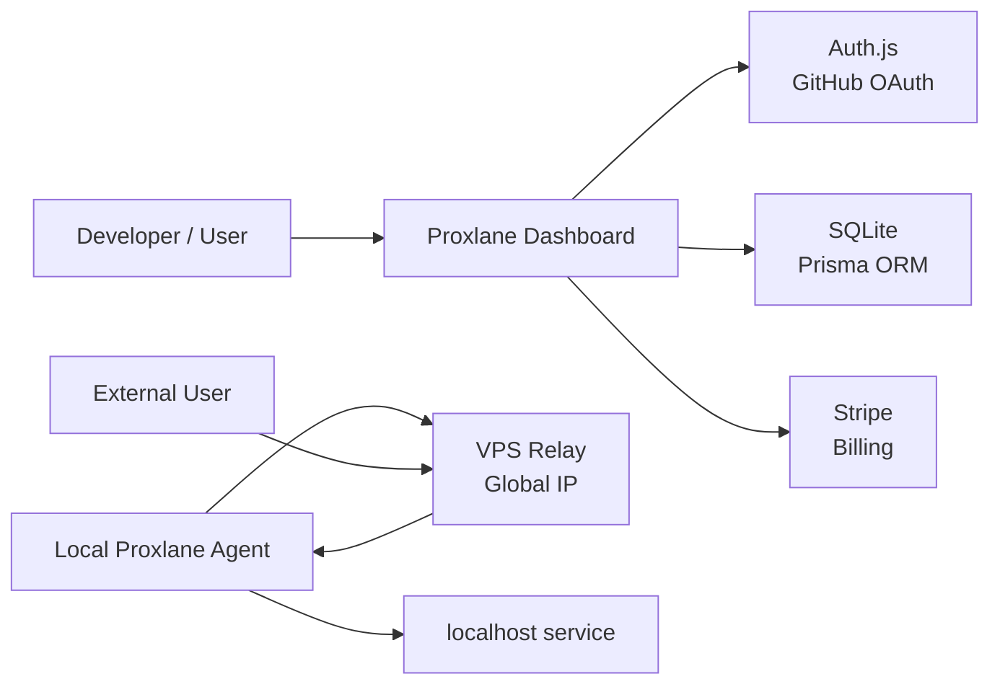

# Proxlane ドキュメント

Proxlane は、ローカル環境の HTTP/TCP サービスをインターネットへ安全に公開するトンネルサービスです。体験としては ngrok に近く、ユーザーは Web でログインしてトークンを取得し、ローカルの Go 製 CLI/Agent に設定して使います。

Proxlane は OSS として開発します。実装、Issue、Pull Request、設定例、デプロイ手順は公開される前提のため、API key、Agent token、GitHub OAuth secret、Auth.js secret、Stripe secret、SQLite DB ファイルなどの秘匿情報をリポジトリに含めない運用を必須とします。

## ドキュメント構成

- [要件定義](docs/requirements.md)
  - サービスの目的、対象ユーザー、機能要件、非機能要件、MVP 範囲。
- [技術仕様](docs/technical-spec.md)
  - Go で実装する前提のアーキテクチャ、トンネルプロトコル、CLI、API、データモデル。
- [技術スタック](docs/tech-stack.md)
  - フロントエンド、Go Relay/Agent、Auth.js、SQLite、Prisma、Stripe、VPS デプロイ、CI/セキュリティツール。
- [フロントエンド画面仕様](docs/frontend-spec.md)
  - Dashboard のページ構成、画面要件、UI コンポーネント、API/状態設計。
- [課金プラン仕様](docs/billing-plans.md)
  - Stripe で扱う Hosted SaaS の Free / Plus / Pro プラン、quota、Webhook 同期方針。
- [運用ノート](docs/operations.md)
  - Stripe 設定、GitHub Releases、DNS、Caddy、systemd、production の接続関係。
- [ロードマップ](docs/roadmap.md)
  - 作る順番、リリース単位、優先度。

## 初期方針

最初から ngrok の全機能を追うのではなく、次の順で作るのが現実的です。

1. TCP トンネルのコアを作る
2. HTTP/HTTPS トンネルとランダムサブドメインを作る
3. Auth.js の GitHub OAuth ログイン、トークン発行、ダッシュボードを作る
4. SQLite + Prisma でユーザー、トークン、利用量を管理する
5. カスタムドメイン、アクセス制御、ログ/メトリクスを足す
6. Stripe でプラン制限と課金へ拡張する

初期インフラは、開発者が所有しているグローバル IP 付き VPS 1 台を Relay として利用します。SaaS として育てる場合でも、最初の実装は「単一 VPS Relay + Auth.js + SQLite + Prisma + Stripe」で始めると、ネットワーク部分を小さく検証できます。

Hosted SaaS の公開ドメインは `proxlane.com` を使用します。現在の production は、アプリ本体を `proxlane.com`、HTTP tunnel を `*.proxlane.com`、Agent control を `connect.proxlane.com`、TCP endpoint を `proxlane.com:<allocated-port>` で動かしています。将来的には HTTP tunnel を `*.t.proxlane.com`、TCP endpoint を `jp-1.tcp.proxlane.com` のように分離する方針です。



## 開発中のトンネル

Go 製の `proxlane` CLI に Relay、TCP Agent、HTTP tunnel を追加しています。

## Hosted SaaS のトンネル利用

`proxlane.com` の Dashboard で Agent token を作成し、ローカル PC に `proxlane` CLI/Agent を入れると、ローカルの HTTP/TCP service を公開できます。v0.1 系の release binary は Linux / Windows から先に配布し、個人向けの接続手順は Dashboard Overview 内の `/app#connect` に置きます。

```bash
curl -fsSL https://proxlane.com/install.sh | sh
```

Windows PowerShell:

```powershell
irm https://proxlane.com/install.ps1 | iex
```

Dashboard Overview の Connect section で作成した CLI token を保存します。通常利用では active token は 1 個だけで、新しい token を作ると古い active token は失効します。

```bash
./proxlane auth <TOKEN>
```

ローカル HTTP service を公開します。

```bash
./proxlane http 3000
```

成功すると次のような URL が表示されます。

```text
HTTP tunnel ready: https://tun-xxxx.proxlane.com -> 127.0.0.1:3000
```

HTTP tunnel は Caddy の On-Demand TLS で active tunnel の host だけ HTTPS を発行します。

```text
https://tun-xxxx.proxlane.com
```

固定したい subdomain は Dashboard の `/app/endpoints` で予約してから使います。

```bash
proxlane http --subdomain my-dev 3000
```

TCP service も公開できます。

```bash
./proxlane tcp 22
```

成功すると次のような address が表示されます。

```text
TCP tunnel ready: tcp://proxlane.com:10000 -> 127.0.0.1:22
```

Minecraft Java server のような TCP service は同じ形で公開できます。

```bash
./proxlane tcp 25565
```

`local service is not accepting connections` または `connection refused` が出る場合、public TCP tunnel までは届いていますが、CLI を実行している環境から `127.0.0.1:<port>` に接続できていません。Minecraft server を起動し、同じ host で待ち受けているか確認してください。別 host、Docker、WSL、LAN 内の別マシンにある場合は local target を明示します。

```bash
./proxlane tcp --host 192.168.1.20 25565
./proxlane tcp 192.168.1.20:25565
```

ローカル開発用 Relay に接続する場合は、明示的に `--server 127.0.0.1:4610` を指定してください。

```bash
# 1. 共有 SQLite DB に Dashboard / Auth.js 用テーブルを作成
DATABASE_URL=file:./dev.db npm run prisma:migrate:deploy

# 2. 開発用 SQLite DB に agent token を作成
go run ./cmd/proxlane token create \
  --database-url file:./apps/web/prisma/dev.db \
  --user-id local \
  --name local-dev

# 3. 出力された token を環境変数へ入れる
export PROXLANE_AGENT_TOKEN='slk_dev_...'

# 4. Relay を DB verifier で起動
go run ./cmd/proxlane relay \
  --database-url file:./apps/web/prisma/dev.db \
  --control-addr 127.0.0.1:4610 \
  --http-addr 127.0.0.1:8080 \
  --http-domain localhost \
  --tcp-host 127.0.0.1 \
  --public-host 127.0.0.1

# 5. 別ターミナルで token を保存
go run ./cmd/proxlane auth \
  --server 127.0.0.1:4610 \
  "$PROXLANE_AGENT_TOKEN"

# 6. ローカル HTTP サービスを公開
go run ./cmd/proxlane http 3000

# 7. ローカル TCP サービスを公開
go run ./cmd/proxlane tcp 22
```

HTTP tunnel は `http://<subdomain>.localhost:8080` のような URL を表示します。ブラウザや `curl` からその Host で Relay にアクセスすると、`127.0.0.1:3000` へ reverse proxy されます。WebSocket / Upgrade 接続も raw stream として中継します。

`tcp://127.0.0.1:<allocated-port>` が表示されたら、そのポートへの TCP 接続が `127.0.0.1:22` に bridge されます。

Agent は control connection 上で ping/pong heartbeat を行い、Relay 切断時は exponential backoff + jitter で自動再接続し、同じ tunnel を再作成します。Relay / Agent は bridge 中の connection を追跡し、tunnel close や shutdown 時に閉じます。転送 connection には `--idle-timeout` で idle deadline を設定できます。

Relay は connection 終了時に `protocol`, `tunnel_id`, `connection_id`, `bytes_in`, `bytes_out`, `duration_ms` をログ出力します。HTTP tunnel では `method`, `path`, `status` も出力します。

Relay はデフォルトで `127.0.0.1:4611` に admin endpoint を開きます。`/healthz` と `/readyz` は JSON で session / tunnel / connection count を返します。`--admin-addr ""` で無効化できます。ログは `--log-format json` で JSON 出力に切り替えられます。

Prisma の初期 schema は `apps/web/prisma/schema.prisma` に置いています。Agent token は `prefix` と `secretHash` を分け、Dashboard/API のレスポンスへ `secretHash` を含めない前提で扱います。`proxlane token create --database-url file:./apps/web/prisma/dev.db` はローカル開発用に SQLite の `User` / `AgentToken` を作成し、平文 token を一度だけ stdout に表示します。Relay は `--database-url file:./apps/web/prisma/dev.db` または `DATABASE_URL` が指定されている場合、SQLite の `AgentToken` テーブルで token を検証し、`lastUsedAt` を更新します。さらに `TunnelSession` に active tunnel を作成し、tunnel close / shutdown 時に `disconnectedAt` を記録します。HTTP request / TCP connection の終了時には `ConnectionLog` に method、path、status、bytes、duration を保存します。未指定の場合は開発用に `--token` / `PROXLANE_RELAY_TOKEN` の static token verifier を使います。

## Dashboard / Auth.js

Next.js App Router の Dashboard は `apps/web` に置いています。GitHub OAuth と Auth.js database session は Prisma Adapter で SQLite に保存します。

```bash
# 1. Web 用 env を作成し、GitHub OAuth の値を入れる
cp apps/web/.env.example apps/web/.env.local

# 2. Auth.js / Dashboard 用テーブルを作成
DATABASE_URL=file:./dev.db npm run prisma:migrate:deploy

# 3. Dashboard を起動
npm run web:dev
```

Prisma の `file:./dev.db` は `apps/web/prisma/schema.prisma` 基準で `apps/web/prisma/dev.db` を指します。Go CLI / Relay から同じ DB を使う場合は、リポジトリ root から `file:./apps/web/prisma/dev.db` を指定します。

`/app/tunnels` はログイン中ユーザーの `TunnelSession` を読み、public URL、protocol、local address、relay id、token prefix、active / stopped 状態を表示します。

`/app/logs` はログイン中ユーザーの `ConnectionLog` を読み、HTTP request と TCP connection を分けて表示します。
