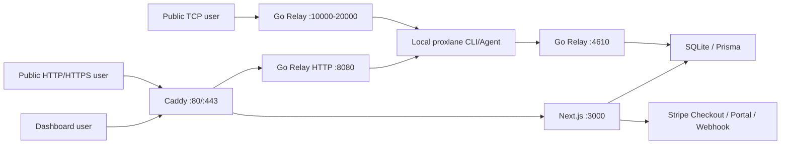

# Proxlane 運用ノート

この文書は、Hosted SaaS として `proxlane.com` を動かすための実作業メモです。設定値そのものではなく、どのサービスがどうつながるか、どこで key / endpoint / price id を取得するかを残します。

## 1. 現在の production 構成



Production の現在形。グローバル IP 付き Linux VPS に Caddy / Next.js / Go Relay / SQLite を同一 host で置く。

| 用途 | 値 |
| --- | --- |
| Dashboard | `https://proxlane.com` |
| GitHub OAuth callback | `https://proxlane.com/api/auth/callback/github` |
| Agent control | `connect.proxlane.com:4610` |
| HTTPS tunnel | `https://<name>.proxlane.com` |
| HTTP tunnel | `http://<name>.proxlane.com` |
| TCP tunnel | `tcp://proxlane.com:<allocated-port>` |
| TCP port range | `10000-20000`, allocated from a random starting point for automatic TCP tunnels |
| Relay admin | `127.0.0.1:4611` |

HTTP tunnel の公開 URL は HTTPS を正とする。TLS は Caddy On-Demand TLS を使う。Caddy は証明書発行前に Relay admin の `/tls-allow?domain=<host>` を呼び、active tunnel として登録されている hostname だけを許可する。Relay は Caddy から来た `X-Forwarded-Proto: https` を local upstream へ引き継ぐ。

## 2. DNS

現在は Xserver 側で次の DNS record を使う。

| Host | Type | Value | 用途 |
| --- | --- | --- | --- |
| `proxlane.com` | A | VPS public IP | Dashboard / TCP endpoint |
| `www.proxlane.com` | A | VPS public IP | Dashboard alias |
| `*.proxlane.com` | A | VPS public IP | HTTP/HTTPS tunnel / `connect` |

将来的には cookie 境界をより明確にするため、HTTP tunnel を `*.t.proxlane.com`、TCP endpoint を `jp-1.tcp.proxlane.com` へ分ける。

## 3. Stripe 設定

### 3.1 Product / Price

Stripe Dashboard の Product Catalog で Product と recurring Price を作成する。

| Product | Price | interval | Env |
| --- | ---: | --- | --- |
| `Proxlane Plus` | 390 JPY | month | `STRIPE_PRICE_PLUS_MONTHLY` |
| `Proxlane Pro` | 980 JPY | month | `STRIPE_PRICE_PRO_MONTHLY` |

Free は Stripe Product を作らず、DB の default plan として扱う。

Price ID は `price_...` の形式。取得後、production env と `.env.example` の該当箇所へ反映する。

### 3.2 Secret key

Stripe Dashboard の Developers > API keys で Secret key を取得する。

| Env | 内容 |
| --- | --- |
| `STRIPE_SECRET_KEY` | `sk_live_...` または test 環境では `sk_test_...` |

公開 repository、issue、docs、chat へ secret key を貼らない。`.env.example` には placeholder のみ置く。

### 3.3 Webhook

Stripe Dashboard の Developers > Webhooks で endpoint を追加する。

| 環境 | Endpoint URL |
| --- | --- |
| Production | `https://proxlane.com/api/billing/webhook` |
| Local | Stripe CLI の forwarding URL |

Subscribe events:

- `checkout.session.completed`
- `customer.subscription.created`
- `customer.subscription.updated`
- `customer.subscription.deleted`

Webhook 作成後、Signing secret `whsec_...` を取得し、次の env に設定する。

| Env | 内容 |
| --- | --- |
| `STRIPE_WEBHOOK_SECRET` | `whsec_...` |

Next.js route handler は raw body と `Stripe-Signature` で署名検証する。Webhook 成功後、`BillingCustomer` に `stripeCustomerId`, `stripeSubscriptionId`, `stripePriceId`, `plan`, `status`, `currentPeriodEnd` を同期する。

## 4. Plan / quota 連携

Dashboard は `/app/billing` で plan と usage を表示する。Relay は tunnel 作成時に SQLite を直接参照し、CLI からの直接操作も同じ制限で止める。

Relay が見るテーブル:

| Table | 用途 |
| --- | --- |
| `AgentToken` | token 検証、userId 解決 |
| `BillingCustomer` | plan / subscription status |
| `Endpoint` | 予約 subdomain の所有確認 |
| `ConnectionLog` | 月間転送量の集計 |
| `TunnelSession` | tunnel 記録 |

MVP の enforcement:

| Quota | 実装 |
| --- | --- |
| active tunnel | Relay の in-memory active tunnel 数で新規作成を拒否 |
| TCP/HTTP 各上限 | protocol 別 active tunnel 数で新規作成を拒否 |
| 月間転送量 | 当月 `ConnectionLog.bytesIn + bytesOut` が上限以上なら新規 tunnel 作成を拒否 |
| 予約 subdomain | `--subdomain` 指定時、同 user の `Endpoint` に予約済みでなければ拒否 |

Reserved Subdomain の user flow:

1. Dashboard `/app/endpoints` で subdomain を予約する。
2. Free は予約不可、Plus は 1 個、Pro は 5 個まで予約できる。
3. 一覧の command copy から `proxlane http --subdomain <name> 3000` を実行する。
4. Relay は `Endpoint.hostname` の owner を SQLite で確認し、別 user または未予約なら tunnel 作成を拒否する。
5. delete は予約の解放のみを行い、すでに張られている active tunnel は停止時までそのまま扱う。

既存 tunnel の途中切断や connection 単位の 429 は後続で実装する。現段階では「新規 tunnel 作成の入口」で制限する。

## 5. Dedicated Download / CLI 配布

CLI ユーザーは terminal 前提のため、配布は `proxlane.com` の専用 download endpoint を正とする。v0.1 系は Linux / Windows を先に公開し、macOS は後続で追加する。

Dashboard Overview の Connect section にある install command は `https://proxlane.com/install.sh` と `https://proxlane.com/install.ps1` を参照する。installer は `https://proxlane.com/api/download/<version>/<asset>` から binary と `SHA256SUMS` を取得するため、GitHub repository の公開状態には依存しない。

VPS 上で専用 download assets を作る手順:

```bash
sudo apt-get install -y zip
PROXLANE_RELEASE_DIR=/var/lib/proxlane/releases sh scripts/publish-release-local.sh v0.1.2
```

この script は指定 version の directory と `latest` を更新する。Next.js 側は `PROXLANE_RELEASE_DIR`、未指定時は `/var/lib/proxlane/releases` を読む。`apps/web/public/install.sh` と `apps/web/public/install.ps1` は root の `scripts/install.*` を指す symlink で、Dashboard の install command は常に `proxlane.com` 配下だけを参照する。

| OS | Arch | Asset |
| --- | --- | --- |
| Linux | amd64 / arm64 | `proxlane_linux_<arch>.tar.gz` |
| Windows | amd64 / arm64 | `proxlane_windows_<arch>.zip` |
| All | all | `SHA256SUMS` |

Install command:

```bash
curl -fsSL https://proxlane.com/install.sh | sh
```

Windows PowerShell:

```powershell
irm https://proxlane.com/install.ps1 | iex
```

ユーザー導線は Dashboard Overview 内の `/app#connect` を正とする。公開ページには download 手順を置かず、Dashboard で token を作成してから local では次の順で使う。通常利用では 1 user につき active CLI token は 1 個とし、新しい token を作ると既存 active token は revoke される。

```bash
proxlane auth <TOKEN>
proxlane http 3000
proxlane tcp 22
```

`proxlane http` / `proxlane tcp` は tunnel ready 表示後に local HTTP/TCP service の疎通を確認し、その後は状態変化時だけ OK/WARN を表示する。既定の監視間隔は 5 秒で、`--no-local-check` または `--local-check-interval 0` で無効化できる。失敗しても tunnel は維持し、local service 起動後に public URL / TCP endpoint を再試行できる。`doctor` は config、token、Relay、DNS まで含めた深い切り分け用として残す。

Implemented tunnel features:

| Feature | Where | Notes |
| --- | --- | --- |
| Startup local check | CLI | `proxlane http` and `proxlane tcp` check the local target after tunnel creation, keep watching it, and print OK/WARN only when reachability changes. |
| `proxlane doctor` | CLI | Checks config, token, relay, DNS, and optional local HTTP/TCP service reachability. Use `proxlane doctor http 3000` or `proxlane doctor tcp 25565` for deeper troubleshooting before opening a support request. |
| Reserved Subdomain | Dashboard `/app/endpoints` + Relay policy | Users reserve hostnames in SQLite. Relay rejects unreserved hostnames and hostnames owned by another user. |
| Traffic Inspector | Dashboard `/app/logs` and `/app/logs/[id]` | Shows stored metadata for HTTP requests and TCP connections: status, method/path, remote addr, duration, bytes, endpoint, relay, and protection type. |
| Endpoint Protection | CLI + Relay | `--basic-auth user:pass` and `--bearer token` are enforced at the relay. Only `protectionType` is stored; secret values are not persisted. |

GitHub Releases の binary は local Agent 用を主目的に `CGO_ENABLED=0` で cross compile する。`auth`, `http`, `tcp`, `version` はこの binary で使える。SQLite を使う `token create` や production Relay は、VPS 上で CGO 有効のまま build した `/usr/local/bin/proxlane` を使う。

サイト上の接続導線は ngrok の Connect 画面に近い構成を Overview 下部へ埋め込む。ログイン後は `/app#connect` で個人の token 状態、install command、HTTP/TCP command、reserved endpoint への導線をまとめて見せる。

1. Install agent
2. Add token
3. Deploy local HTTP/TCP service
4. Reserve endpoint / observe logs

`/app/logs` は `ConnectionLog.userId` で絞り、関連する `TunnelSession` も同じ userId で再取得する。他 user の request / connection log を表示しない。

Traffic Inspector MVP は `ConnectionLog` と `TunnelSession` に保存済みの metadata のみを表示する。HTTP headers、request body、response body、replay payload は保存しない。これらは secret / personal data を含みやすいため、後続で明示 opt-in、retention、redaction を決めてから追加する。

Endpoint Protection MVP は HTTP tunnel のみ対応する。CLI の `--basic-auth user:pass` / `--bearer token` は Relay へ送られ、Relay が request を認証してから Agent に転送する。DB へ保存するのは `TunnelSession.protectionType` のみで、password / bearer token は保存しない。認証に使った `Authorization` header は local service へ転送しない。

## 6. systemd / Caddy

Repository には雛形を置く。

| File | 用途 |
| --- | --- |
| `deploy/proxlane-relay.service.example` | Relay systemd unit |
| `deploy/Caddyfile.example` | Dashboard と tunnel routing |

Production の secret や DB file は repository に入れない。

## 7. 変更時に更新する場所

Stripe Product / Price / Webhook を変更したら:

- `docs/billing-plans.md`
- `docs/operations.md`
- `.env.example`
- `apps/web/.env.example`
- production env

Relay port / domain / Caddy routing を変更したら:

- `docs/operations.md`
- `deploy/Caddyfile.example`
- `deploy/proxlane-relay.service.example`
- README の Hosted SaaS section

CLI 配布を変更したら:

- `.github/workflows/release.yml`
- `scripts/install.sh`
- `scripts/install.ps1`
- `/app#connect`
- README の install section
